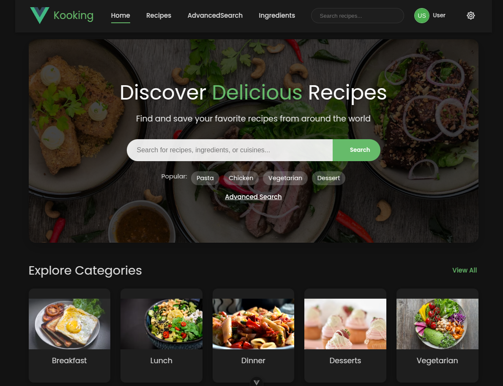
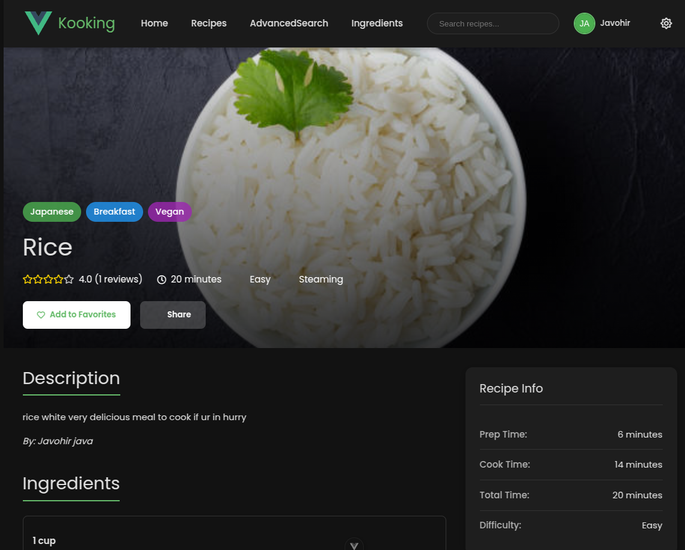
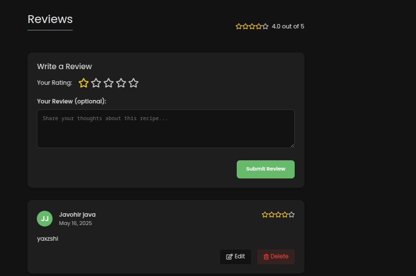

# 🍳 Kooking – Smart Recipe Generator

**Kooking** is a smart, modern cooking companion that helps users discover personalized recipes based on their preferences, available ingredients, time of day, and more. Built as a Progressive Web App (PWA) for web and mobile, Kooking makes meal planning simple, fast, and enjoyable.

## 🎥 Kooking Application Demo

[](https://www.youtube.com/watch?v=fW8X5SrybLA)

> Curious how Kooking works in action?  
> 🚀 **[Click here to watch the full walkthrough](https://www.youtube.com/watch?v=fW8X5SrybLA)**!


- 🕓 **Time-based Recommendations** – Get recipe suggestions based on the current time of day.
- 🧑‍🍳 **User-friendly Interface** – Intuitive design for easy navigation and recipe discovery.
- 🍞 **Recipe Management** – Add, edit, and delete your own recipes.
- 🧑‍🤝‍🧑 **Community Recipes** – Explore and contribute to a community of shared recipes.
- 📊 **Recipe Ratings** – Rate and review recipes to help others find the best ones.
- 🔍 **Advanced Search Filters** – Filter recipes by dietary restrictions, cuisine, cooking time, and more.
- 🔐 **User Accounts** – Register, log in, and manage your saved recipes.
- 📖 **Recipe Details** – View detailed information about each recipe, including ingredients and instructions.
- 🔍 **Search Functionality** – Quickly find recipes by name or ingredient.
- 💾 **Save Favorite Recipes** – Bookmark your favorite recipes for easy access.
- 🛒 **Shopping List** – Generate a shopping list based on selected recipes.
- 📊 **Nutritional Information** – View nutritional details for each recipe.
- 🗂 **Recipe Categories** – Browse recipes by categories like breakfast, lunch, dinner, and snacks.

## 🖼️ Screenshots
### 🍽️Home Page

### 🍽️ Recipe Page

### 🍽 Review Page

## 🌟 Features

## 🛠️ Tech Stack

### Frontend
- [Vue 3](https://vuejs.org/) + [JavaScript](https://www.javascript.com/) – Core framework
- [Vue Router](https://router.vuejs.org/) – Routing
- [Vuex](https://vuex.vuejs.org/) – State management
- [Vue Composition API](https://vuejs.org/guide/extras/composition-api-faq.html) – Composition API
- [Vue CLI](https://cli.vuejs.org/) – Project scaffolding
- [Pinia](https://pinia.vuejs.org/) – State management
- [Axios](https://axios-http.com/) – API calls

### Backend
- [Spring Boot 3](https://spring.io/projects/spring-boot)
- [Java 17](https://www.oracle.com/java/technologies/javase/jdk17-archive-downloads.html) – Core framework
- [Spring Data JPA](https://spring.io/projects/spring-data-jpa) – Database access
- [Spring Security](https://spring.io/projects/spring-security) – Authentication and authorization
- [Spring Web](https://spring.io/projects/spring-framework) – RESTful APIs
- [H2 Database](https://www.h2database.com/html/main.html) – In-memory database for development
- [PostgreSQL](https://www.postgresql.org/) – Production database
- [MapStruct](https://mapstruct.org/) – Object mapping
- [JUnit 5](https://junit.org/junit5/) – Testing framework
- [Mockito](https://site.mockito.org/) – Mocking framework
- [Lombok](https://projectlombok.org/) – Boilerplate code reduction
---

## 🚀 Getting Started

### 📦 Prerequisites

* [Bun](https://bun.sh/) installed (`curl -fsSL https://bun.sh/install | bash`)
* Java 17+
* Maven
* H2 or PostgreSQL

---

## 🧩 Backend Setup (Spring Boot)

1. **Clone the repository**:

   ```bash
   git clone https://github.com/yourusername/kooking.git
   cd kooking/backend
   ```

2. **Configure application properties**:
   Check properties `src/main/resources/application.properties` with the following:

   ```properties
   # Application
   spring.application.name=kooking
   server.port=8098

   # Security
   spring.security.user.name=sina
   spring.security.user.password=miller
   cors.allowed-origins=http://localhost:8098,http://localhost:8080,https://myfrontend.zrok.defgun.blog

   # JWT
   jwt.secret=9df8505bb4eb7833d0f07cebec765d065344850a4548a5f8c3a9ffea5c01e6bd
   logging.level.org.springframework.security=DEBUG

   # H2 DB (file-based)
   spring.datasource.url=jdbc:h2:file:./data/kookingdb
   spring.datasource.driver-class-name=org.h2.Driver
   spring.datasource.username=sa
   spring.datasource.password=
   spring.jpa.database-platform=org.hibernate.dialect.H2Dialect
   spring.jpa.hibernate.ddl-auto=update
   spring.h2.console.enabled=true
   spring.h2.console.path=/h2-console
   spring.h2.console.settings.web-allow-others=true
   spring.jpa.properties.hibernate.hbm2ddl.import_files_sql_extractor=org.hibernate.tool.schema.internal.script.MultiLineSqlScriptExtractor

   # Google OAuth2
   spring.security.oauth2.client.registration.google.client-id=606716944314-8c2aiqdp2q8gea4e9vn80qfkk5k22uko.apps.googleusercontent.com
   spring.security.oauth2.client.registration.google.client-secret=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
   spring.security.oauth2.client.registration.google.scope=email,profile
   spring.security.oauth2.client.registration.google.redirect-uri=https://localhost:8098/login/oauth2/code/google
   app.frontend.base-url=https://localhost:8080
   ```

3. **Run the application and tests**:

   ```bash
   mvn spring-boot:run
   mvn test
   ```

---

## 🖼️ Frontend Setup (Vue 3 + Bun)

1. **Navigate to the frontend directory**:

   ```bash
   cd ../frontend
   ```

2. **Install dependencies**:

   ```bash
   bun install
   ```

3. **Run the development server**:

   ```bash
   bun run dev
   ```

4. Open your browser at [http://localhost:8080](http://localhost:8080)

---

## 🧪 Sample API Usage

To test your backend API (example):

```http
POST /api/auth/register
Content-Type: application/json

{
  "email": "user@example.com",
  "password": "securePassword123",
  "confirmPassword": "securePassword123",
  "firstName": "John",
  "lastName": "Doe"
}
```

---
---

## 🤝 Contributing

Stay Tuned for Updates!


---

## 📄 License

This project is licensed under the [MIT License](LICENSE).

---

## 👨‍🍳 Author

Made with ❤️ by java.
